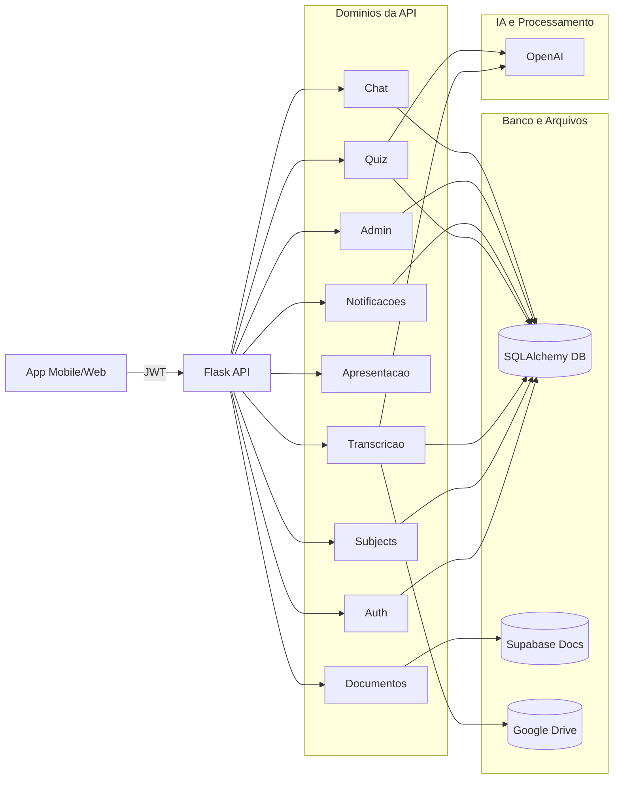

# Backend Python - ATIVA IA (API)

Backend Flask que atende o app ATIVA IA com autenticacao, disciplinas, transcricao, quizzes, apresentacao e administracao.

## Para quem e este documento

- Pessoas nao tecnicas: entender o que a API oferece e como ela suporta o produto
- Pessoas tecnicas: entender arquitetura, rotas, servicos, integracoes e configuracao

## Visao geral do produto (lado servidor)

O backend expõe rotas REST para:

- Autenticacao (JWT)
- Gestao de disciplinas, matriculas e materiais
- Transcricao de aula com atividades ao vivo
- Quizzes com ranking e relatorios
- Apresentacao em tempo real (polling)
- Admin e configuracoes do sistema

## Arquitetura (alto nivel)

- Flask app factory com Blueprints (rotas por dominio)
- SQLAlchemy para persistencia
- Middleware de auth e controle de acesso (admin/super_admin)
- Servicos externos: OpenAI, Google Drive, Supabase, N8N

## Estrutura do projeto (mapa rapido)

backend-python/
- app/__init__.py: factory, extensoes, registro de blueprints
- app/config.py: configuracoes por ambiente
- app/routes/: endpoints e orquestracao
- app/controllers/: regras de negocio
- app/models/: entidades SQLAlchemy
- app/services/: integracoes externas
- app/middleware/: auth e admin
- app/utils/: JWT e utilitarios
- run.py: entrypoint

## Rotas registradas (principais)

As rotas abaixo estao registradas em app/__init__.py.

- Auth: /api/auth
  - POST /register, /login, /quick-access, /forgot-password
  - GET /me
- Subjects: /api/subjects
  - GET / (lista), GET /:id, GET /:id/materials, POST /:id/materials
  - GET /:id/activities, GET /student/materials
- AI Sessions: /api/ai
  - GET /session/:subject_id
  - GET /session/:session_id/messages
  - GET /sessions/:subject_id/all
  - POST /session/new, POST /session/:session_id/activate
  - DELETE /session/:session_id
- Notifications: /api/notifications
  - POST /send
  - GET /student/:student_id
- Admin: /api/admin
  - POST /users, /subjects, /enroll, /teach
  - GET /users, /subjects
  - POST /enroll-all-students
- Chat: /api/chat
  - GET /history/:subject_id
  - POST /save
  - DELETE /clear/:subject_id
- Enrollments: /api/enrollments
  - POST /auto-enroll
- Transcription: /api/transcription
  - /sessions (POST), /sessions/:id (GET, PUT)
  - /sessions/:id/checkpoint, /sessions/:id/resume, /sessions/:id/end
  - atividades ao vivo, distribuicao, relatorios (ver arquivo)
- Presentation: /api/presentation
  - POST /start, POST /:code/send, POST /:code/clear, POST /:code/end
  - GET /:code, GET /:code/status
- Settings: /api/settings
  - GET /public
  - GET /, POST / (super_admin)
- Documents: /api/documents
  - GET /retrieve, GET /list, POST /send_to_presentation (ver arquivo)

Observacao: existem arquivos de rotas que NAO estao registrados no app factory atualmente:
- app/routes/performance_routes.py
- app/routes/pdf_control_routes.py
Se for usar, registre no app/__init__.py.

## Fluxos principais (tecnico)

### Autenticacao

- [app/routes/auth_routes.py](app/routes/auth_routes.py)
- [app/middleware/auth_middleware.py](app/middleware/auth_middleware.py)
- Token JWT via header Authorization: Bearer <token>

### Transcricao e atividades ao vivo

- [app/routes/transcription_routes.py](app/routes/transcription_routes.py)
- Modelos: TranscriptionSession, LiveActivity, LiveActivityResponse
- Cria sessao, pausa por checkpoint e gera atividades (quiz, resumo, pergunta aberta)

### Quizzes e relatorios

- [app/routes/quiz_routes.py](app/routes/quiz_routes.py)
- Modelos: Quiz, QuizQuestion, QuizResponse
- Relatorios e exportacao usam [app/services/pdf_service.py](app/services/pdf_service.py)

### Apresentacao (tela secundaria)

- [app/routes/presentation_routes.py](app/routes/presentation_routes.py)
- Polling por /:code/status e /:code para conteudo atual
- WebSocket existe, mas esta desativado no app factory

### Documentos e base de conhecimento

- [app/routes/document_routes.py](app/routes/document_routes.py)
- Integra com Supabase para recuperar chunks e montar secoes

## Integracoes externas

- OpenAI: [app/services/ai_service.py](app/services/ai_service.py)
- Google Drive: [app/services/google_drive_service.py](app/services/google_drive_service.py)
- Supabase: via client no document_routes
- N8N: usado no frontend para processamento e transcricao

## Variaveis de ambiente

- FLASK_ENV=development|production|test
- PORT=3000
- JWT_SECRET=...
- DATABASE_URL=...

- OPENAI_API_KEY=...
- GOOGLE_DRIVE_FOLDER_ID=...
- GOOGLE_TOKEN_JSON=... (opcional)
- GOOGLE_TOKEN_JSON_PATH=... (opcional)
- GOOGLE_CREDENTIALS_JSON=... (opcional)
- GOOGLE_APPLICATION_CREDENTIALS=... (opcional)

- SUPABASE_URL=...
- SUPABASE_ANON_KEY=... (ou SUPABASE_SERVICE_KEY)

## Como rodar

1) Criar ambiente virtual

```bash
python -m venv venv
```

2) Ativar ambiente

Windows:
```bash
venv\Scripts\activate
```

Linux/Mac:
```bash
source venv/bin/activate
```

3) Instalar dependencias

```bash
pip install -r requirements.txt
```

4) Rodar servidor

```bash
python run.py
```

Servidor em http://localhost:3000

## Diagrama (mapa visual da API)



## Observacoes tecnicas

- WebSocket existe em [app/services/websocket_service.py](app/services/websocket_service.py), mas nao esta habilitado no app factory
- A apresentacao funciona por polling, com timestamp em /presentation/:code/status
- PDF control via voz esta em app/routes/pdf_control_routes.py, mas precisa ser registrado

